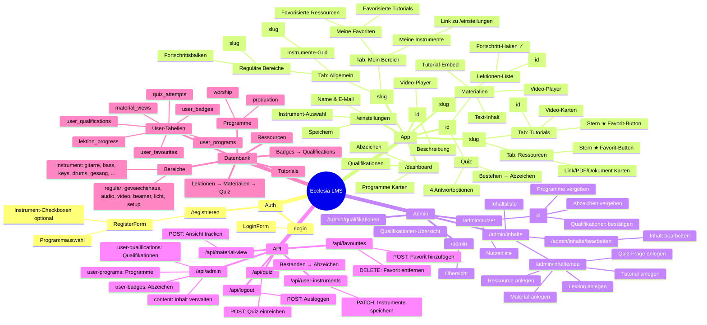

# Ecclesia LMS — App-Struktur

## Tech Stack

| Schicht   | Technologie                        |
| --------- | ---------------------------------- |
| Frontend  | Next.js 16, App Router, TypeScript |
| Styling   | Tailwind CSS                       |
| Auth + DB | Supabase (PostgreSQL + RLS)        |
| Hosting   | Vercel                             |
| Branch    | `feature/implementation`           |
| GitHub    | kranzo21/Bootcamp                  |

## Routen-Übersicht

| Route                    | Beschreibung                                    |
| ------------------------ | ----------------------------------------------- |
| `/login`                 | Login-Seite                                     |
| `/registrieren`          | Registrierung mit Programm- & Instrumentwahl    |
| `/dashboard`             | Übersicht: Programme, Abzeichen, Quals          |
| `/programm/[slug]`       | Programm-Seite mit 2 Tabs                       |
| `/bereich/[slug]`        | Bereich mit Lektionen-Liste                     |
| `/instrument/[slug]`     | Instrument: Tutorials & Ressourcen favorisieren |
| `/lektion/[id]`          | Lektion: Materialien + Quiz                     |
| `/tutorial/[id]`         | Tutorial: Video                                 |
| `/einstellungen`         | Account & Instrument-Einstellungen              |
| `/admin`                 | Admin-Bereich (nur Admins)                      |
| `/admin/nutzer`          | Nutzerverwaltung                                |
| `/admin/inhalte`         | Inhaltsverwaltung                               |
| `/admin/qualifikationen` | Qualifikationen verwalten                       |
